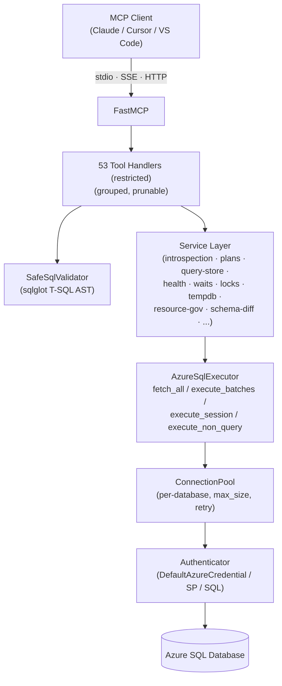

# Azure SQL MCP

**Production-grade Model Context Protocol server for Azure SQL Database.**

63 tools across query execution, deep performance diagnostics, schema comparison, token-safe artifacts, and audited administration — built and live-tested against real Azure SQL DB tiers. Restricted deployments expose 53 non-admin tools by default.

Comprehensive unit and integration coverage is included; run `uv run pytest -q` for the current test counts in your environment.

---

## Why this exists

LLMs are extraordinarily good at writing T-SQL and reading execution plans. They are catastrophically bad at it without structured tools that give them schema, statistics, plans, and DMV state in a token-efficient form.

Most SQL MCP servers are toy wrappers around `cursor.execute()`. Azure SQL MCP is built the way an Azure SQL DBA would build one:

- **Read-only by default.** Restricted mode parses every query through `sqlglot`'s T-SQL dialect and rejects anything that isn't a single safe SELECT — including blocking `EXEC`, `DBCC`, temp tables, external rowsets, dynamic SQL, and cross-database / linked-server names. Defense-in-depth, not a regex.
- **Memory-safe.** Server-side `fetchmany(row_limit + 1)` instead of `fetchall()`. A 10M-row `SELECT *` won't OOM the MCP host or burn the model's context window.
- **Tier-aware.** DMV queries are written to survive across GeneralPurpose / BusinessCritical / Hyperscale, where columns like `primary_max_cpu_percent` and catalogs like `sys.master_files` only exist on some tiers. Found and fixed in live testing — see the [Azure SQL DB gotchas](#azure-sql-db-gotchas) section.
- **Session-scoped SET handling.** Tools like `explain_query` need `SET SHOWPLAN_XML ON` to persist across a pooled connection — Azure SQL MCP has a custom `execute_session` path so the SET and the query share a single physical connection. Most other servers silently get this wrong.
- **Token-efficient by tool grouping.** Run with `--azure-sql-tool-groups core` (15 tools) instead of the full restricted surface (53 tools) when you want a slim surface.
- **HTTP bearer auth.** SSE and Streamable HTTP transports require `AZURE_SQL_MCP_BEARER_TOKEN` and validate `Authorization: Bearer ...` with constant-time comparison.
- **Audited write policy.** Unrestricted admin tools default to dry-run review. Raw arbitrary SQL execution is limited to read-only SELECT batches; writes run through generated, audited admin tools and require `AZURE_SQL_WRITE_POLICY=apply`.

---

## Quickstart

```bash
git clone https://github.com/AkaalHoldings/azure-sql-mcp.git
cd azure-sql-mcp
uv sync

export AZURE_SQL_SERVER="your-server.database.windows.net"
export AZURE_SQL_DEFAULT_DATABASE="appdb"
export AZURE_SQL_ALLOWED_DATABASES="appdb,reportingdb"
export AZURE_SQL_AUTH_MODE="entra-default"   # uses az login / managed identity
export AZURE_SQL_ACCESS_MODE="restricted"

uv run azure-sql-mcp
```

That's a fully-functional read-only MCP server on stdio, ready to plug into Claude Desktop, Cursor, or any other MCP client.

---

## Install

Requires Python 3.12+ and [`uv`](https://github.com/astral-sh/uv).

```bash
cd azure-sql-mcp
uv sync
```

**On Linux**, `mssql-python` needs the runtime libraries documented by Microsoft. The included `Dockerfile` installs them on Debian:

```bash
docker compose up --build
```

No external ODBC driver manager is required — `mssql-python` ships its own driver.

---

## Configure

All settings are env vars. CLI flags override env vars.

### Required

| Variable | Purpose |
|---|---|
| `AZURE_SQL_SERVER` | Logical server FQDN, e.g. `sqltestit.database.windows.net` |
| `AZURE_SQL_DEFAULT_DATABASE` | Database used when a tool call omits `database_name` |
| `AZURE_SQL_ALLOWED_DATABASES` | Comma-separated allowlist. `default_database` must be in this list. |

### Access mode

| Variable | Default | Values |
|---|---|---|
| `AZURE_SQL_ACCESS_MODE` | `restricted` | `restricted` (read-only validator), `unrestricted` (adds arbitrary SQL + audited admin tools) |
| `AZURE_SQL_WRITE_POLICY` | `review` in unrestricted, `disabled` in restricted | `disabled`, `review`, `apply`. Execution requires `apply`; dry-run previews work in `review`. |
| `AZURE_SQL_AUDIT_DIR` | `~/.azure-sql-mcp/audit` | JSONL audit directory for write previews, applies, blocks, and failures |
| `AZURE_SQL_AUDIT_FULL_SQL` | `0` | Set `1` to include full SQL in audit records. Default stores SQL hash + preview only. |
| `AZURE_SQL_ENABLE_REMOTE_ADMIN` | `0` | Required to expose apply-capable admin tools or `AZURE_SQL_WRITE_POLICY=apply` over `sse`/`streamable-http`. `stdio` local-process admin behavior is unchanged. |

### Auth (`AZURE_SQL_AUTH_MODE`)

| Mode | Required env vars |
|---|---|
| `entra-default` *(default)* | none — uses `DefaultAzureCredential` (az CLI, managed identity, env, etc.) |
| `service-principal` | `AZURE_TENANT_ID`, `AZURE_CLIENT_ID`, `AZURE_CLIENT_SECRET` |
| `interactive` | none — opens a browser flow |
| `sql-password` | `AZURE_SQL_USERNAME`, `AZURE_SQL_PASSWORD` |

### Tool grouping (token efficiency)

| Variable | Default | Values |
|---|---|---|
| `AZURE_SQL_TOOL_GROUPS` | `all` | Comma-separated list of `core`, `performance`, `schema`, `admin`, `all` |

Example: `AZURE_SQL_TOOL_GROUPS=core,performance` exposes 50 tools instead of all 53 restricted tools.

### Limits & runtime

| Variable | Default | Purpose |
|---|---|---|
| `AZURE_SQL_ROW_LIMIT` | `200` | Max rows returned per query (server-side `fetchmany`) |
| `AZURE_SQL_QUERY_TIMEOUT_SECONDS` | `30` | Per-query timeout |
| `AZURE_SQL_TOOL_TIMEOUT_SECONDS` | `query_timeout + 15` | Outer per-tool-call timeout; must be >= the query timeout |
| `AZURE_SQL_POOL_SIZE` | `5` | Per-database connection pool size |
| `AZURE_SQL_MAX_RETRIES` | `3` | Retries for transient connection failures |
| `AZURE_SQL_LOG_LEVEL` | `INFO` | `DEBUG` / `INFO` / `WARNING` / `ERROR` |
| `AZURE_SQL_LOG_FORMAT` | `text` | `text` or `json` |

### Transports

```bash
uv run azure-sql-mcp                                                  # stdio (default)
uv run azure-sql-mcp --transport sse --host 0.0.0.0 --port 8000
uv run azure-sql-mcp --transport streamable-http --host 0.0.0.0 --port 8000
```

Remote transports require `AZURE_SQL_MCP_BEARER_TOKEN`:

```bash
export AZURE_SQL_MCP_BEARER_TOKEN="$(openssl rand -hex 32)"
curl -H "Authorization: Bearer $AZURE_SQL_MCP_BEARER_TOKEN" http://127.0.0.1:8000/mcp
```

Bearer auth is transport-level protection only; use TLS from a reverse proxy/API gateway and do not expose the server directly to the public internet.

---

## MCP client setup

### Claude Desktop

`~/Library/Application Support/Claude/claude_desktop_config.json` (macOS):

```json
{
  "mcpServers": {
    "azure-sql": {
      "command": "uv",
      "args": ["--directory", "/path/to/azure-sql-mcp", "run", "azure-sql-mcp"],
      "env": {
        "AZURE_SQL_SERVER": "your-server.database.windows.net",
        "AZURE_SQL_DEFAULT_DATABASE": "appdb",
        "AZURE_SQL_ALLOWED_DATABASES": "appdb",
        "AZURE_SQL_AUTH_MODE": "entra-default"
      }
    }
  }
}
```

### VS Code (MCP extension)

```json
{
  "mcp.servers": {
    "azure-sql": {
      "command": "uv",
      "args": ["--directory", "/path/to/azure-sql-mcp", "run", "azure-sql-mcp"],
      "env": {
        "AZURE_SQL_SERVER": "your-server.database.windows.net",
        "AZURE_SQL_DEFAULT_DATABASE": "appdb",
        "AZURE_SQL_ALLOWED_DATABASES": "appdb"
      }
    }
  }
}
```

### Cursor

```json
{
  "mcpServers": {
    "azure-sql": {
      "command": "uv",
      "args": ["--directory", "/path/to/azure-sql-mcp", "run", "azure-sql-mcp"],
      "env": {
        "AZURE_SQL_SERVER": "your-server.database.windows.net",
        "AZURE_SQL_DEFAULT_DATABASE": "appdb",
        "AZURE_SQL_ALLOWED_DATABASES": "appdb"
      }
    }
  }
}
```

---

## Tool catalogue

63 tools across 4 groups. Tools marked **(unrestricted)** require `AZURE_SQL_ACCESS_MODE=unrestricted`; restricted deployments advertise 53 tools.

### `core` — query, introspection, health (15 tools)

| Tool | Purpose |
|---|---|
| `list_databases` | List databases configured in `AZURE_SQL_ALLOWED_DATABASES` |
| `check_capabilities` | Probe permission-sensitive features (Query Store, SHOWPLAN, DMV access) |
| `list_schemas` | List user schemas |
| `list_objects` | List tables, views, procedures, functions, or indexes in a schema |
| `search_objects` | Cross-schema name-pattern search |
| `get_object_details` | Columns, indexes, constraints, definition |
| `get_dependencies` | What this object references and what references it |
| `get_table_stats` | Approximate row counts and storage breakdown |
| `execute_sql` | Read-only SQL through the safety validator; optional `DECLARE`/`SET @var` prefix before a single SELECT |
| `explain_query` | Estimated or actual execution plan for read-only SQL; raw SHOWPLAN XML is stored as an MCP artifact URI by default |
| `tune_query` | Structured single-query evidence pack: plan summary, bounded sample, Query Store context, stats, waits, and index analysis |
| `benchmark_query_rewrite` | Compare a baseline query and rewrite with bounded samples, plan summaries, and sample equivalence metadata |
| `get_top_queries` | Query Store top-N by duration / CPU / IO / executions / memory / resource blend |
| `analyze_index_recommendations` | Missing-index DMV + automatic-tuning recommendations |
| `analyze_db_health` | 11 health checks: index, buffer, autotune, storage, query-store, log-rate, etc. |

### `performance` — deep diagnostics & tuning (35 tools)

**Query analysis & tuning**
- `analyze_query_indexes` — recommend indexes for up to 10 queries via plan analysis
- `analyze_workload_indexes` — workload-driven index recommendations from Query Store
- `optimize_indexes` — end-to-end index optimization
- `compare_query_plans` — diff two execution plans
- `detect_regressed_queries` — find queries whose plans got worse
- `detect_parameter_sniffing` — identify parameter-sensitive plans
- `get_query_parameter_buckets` — compiled parameter values per Query Store plan for one query (the parameter buckets a tuning pass must test)
- `get_forced_plans` — list Query Store forced plans
- `plan_health_review` — read-only Query Store health review with ranked plan findings
- `review_plan_enforcement` — read-only regression/forced-plan review with candidate force/unforce actions
- `dry_run_plan_action` — exact reversible force/unforce action preview with audit record
- `plan_enforcer_tick` — bounded review cycle that dry-runs by default and applies only when write policy allows

**Wait stats & blocking**
- `get_wait_stats` — `sys.dm_db_wait_stats` with category mapping (CPU/IO/Lock/Memory/Network) and benign filtering
- `get_query_wait_stats` — per-query wait breakdown from Query Store
- `get_currently_waiting_tasks` — real-time blocked tasks from `sys.dm_os_waiting_tasks`
- `get_active_sessions` — running queries with blocking chains
- `get_lock_details` — current locks with mode, resource, and SQL text
- `get_open_transactions` — open transactions with duration, type, log bytes, warnings
- `get_deadlock_history` — parsed deadlock XML from `system_health` xevent session

**Tempdb & memory**
- `get_tempdb_usage` — per-session tempdb consumption
- `get_tempdb_space_breakdown` — version store / user / internal / free
- `get_memory_grants` — granted vs. requested memory with pending grants

**Resource governance & I/O**
- `get_io_stats` — per-file latency, throughput, pending I/O (Azure-SQL-DB-safe)
- `get_resource_limits` — service objective + governance limits (tier-tolerant)
- `get_resource_stats_history` — `sys.dm_db_resource_stats` history with sustained-pressure detection
- `get_connection_pool_stats` — MCP-side connection pool metrics and leak detection (no database round-trip)

**Diagnostic query parity**
- `get_database_configuration` — version, database properties, scoped configs, Query Store, automatic tuning, geo-replication, and Azure DB properties
- `get_storage_diagnostics` — data/log file space, log usage, VLF counts, and high-usage warnings
- `get_connection_diagnostics` — connection counts by IP plus optional bounded input-buffer rows; input-buffer SQL text is disabled by default because it can contain sensitive literals
- `get_top_cached_queries` — top cached statement metrics without raw plan XML
- `get_cached_routine_stats` — cached stored procedure and UDF metrics without raw plan XML
- `get_object_index_diagnostics` — write-heavy indexes, index usage, buffer footprint, volatile stats, columnstore row groups, lock waits, and resumable rebuilds

**Plan cache & statistics**
- `get_plan_cache_analysis` — plan cache pressure, single-use plans, recompiles
- `get_query_compilation_stats` — compilation hot-spots
- `check_statistics_health` — stale / out-of-date statistics

### `schema` — schema comparison & migration (3 tools)

- `capture_schema_snapshot` — point-in-time snapshot of tables, views, procs, functions, indexes, FKs
- `compare_schemas` — diff two databases with grouped, categorized differences
- `generate_migration_script` — emit T-SQL to transform source schema → target schema

### `admin` — write & destructive operations (10 tools, **unrestricted**)

- `execute_tsql_unrestricted` — audited raw SQL preview/execution path; apply execution is limited to read-only SELECT batches, with hard-denylist protection and dry-run by default
- `rebuild_index` — `ALTER INDEX REBUILD` / `REORGANIZE` with `ONLINE = ON`
- `update_statistics` — `UPDATE STATISTICS` with optional sample percent
- `force_query_plan` — `sp_query_store_force_plan` / `sp_query_store_unforce_plan`
- `set_query_store_hints` — `sp_query_store_set_hints` with a strict allowlist grammar for the hints string (documented Query Store hints only); rollback SQL attached
- `clear_query_store_hints` — `sp_query_store_clear_hints`
- `create_test_index` — `CREATE NONCLUSTERED INDEX` for disposable, `IX_Testing_`-prefixed test indexes only (prefix enforced, identifiers strictly validated, `ONLINE=ON` default, rollback DROP attached)
- `drop_test_index` — `DROP INDEX` restricted to the `IX_Testing_` prefix; cannot touch real indexes
- `apply_plan_action` — audited Query Store force/unforce apply path for reviewed plan actions
- `kill_session` — `KILL <spid>` with system-SPID guard (refuses `<= 50`)

Every admin tool accepts `dry_run` and defaults to `true`. Execution requires both `dry_run=false` and `AZURE_SQL_WRITE_POLICY=apply`.

---

## Security model

### Restricted mode (default)

The `execute_sql` tool routes every query through `SafeSqlValidator` (`safe_sql.py`), which:

1. **Text pre-checks** reject obvious red flags before parsing.
2. **`sqlglot` AST parse** in T-SQL dialect rejects anything that isn't a single read-only statement.
3. **AST inspection** rejects any node referencing dangerous surface area.

**Allowed:** `SELECT`, CTEs, set operators (`UNION`/`EXCEPT`/`INTERSECT`), `sys.*` catalog reads, `OPENJSON`, parameterized values, and an optional `DECLARE` / `SET @variable` prefix before the single SELECT (used by parameter auto-binding; session SET options are still rejected).

**Blocked:** all DML/DDL, `EXEC`, `GO` batches, `DBCC`, temp tables, external rowsets (`OPENROWSET`, `OPENDATASOURCE`), extended procedures, OLE automation, cross-database three-part names, linked-server four-part names, dynamic SQL.

### Unrestricted mode

Setting `AZURE_SQL_ACCESS_MODE=unrestricted` adds admin tools without weakening restricted-mode `execute_sql`. The safe query tool **continues to validate** every SELECT.

Write-capable tools are governed by `AZURE_SQL_WRITE_POLICY`:

- `review` (default): previews SQL, records an audit entry, and refuses execution.
- `apply`: permits execution only when the tool call also sets `dry_run=false`.
- `disabled`: blocks write execution.

Raw arbitrary SQL always passes through a hard denylist and must parse as read-only SELECT-style batches before it can execute. Use generated admin tools for maintenance, session kill, statistics, index, and Query Store writes. Generated maintenance and Query Store statements are audited through the same policy layer. Audit records are JSONL in `AZURE_SQL_AUDIT_DIR` with directory/file permissions tightened where the OS allows; by default they store a SQL hash and preview, not full SQL.

Query Store apply behavior is deliberately narrow: `apply_plan_action` and `force_query_plan` can only call `sp_query_store_force_plan` / `sp_query_store_unforce_plan` with integer IDs and return rollback SQL.

### Transport authentication

`stdio` is local-process only and does not require a bearer token. `sse` and `streamable-http` fail startup unless `AZURE_SQL_MCP_BEARER_TOKEN` is set, and clients must send `Authorization: Bearer <token>`. Remote transports do not expose apply-capable admin behavior unless `AZURE_SQL_ENABLE_REMOTE_ADMIN=1` is also set.

### Database allowlist

Every tool call resolves `database_name` against `AZURE_SQL_ALLOWED_DATABASES` (case-insensitively, matching Azure SQL semantics). Calls referencing a database not in the allowlist fail before any connection is opened. There is no way to escape the allowlist short of changing the env var.

### Memory safety

`AzureSqlExecutor._consume_batches` uses `cursor.fetchmany(row_limit + 1)` instead of `cursor.fetchall()`. The `+ 1` lets the server detect truncation without loading the entire result set. A `SELECT * FROM huge_table` returns 201 rows, sets `truncated: true`, and never blows out memory.

### Token-safe artifacts

Large payloads are returned by reference. `explain_query` stores raw SHOWPLAN XML in a bounded in-memory MCP resource (`azuresql-artifact://...`) and returns `raw_xml_length`, `raw_xml_hash`, expiry, and `raw_xml_resource_uri`. Set `include_raw_xml=true` only when a client really needs inline XML.

---

## Architecture



Key invariants:

- **Single logical server per MCP instance.** Multiple databases on that server are exposed via the allowlist.
- **`execute_session` keeps a single physical connection** across a sequence of statements — required for session-scoped SET options like `SET SHOWPLAN_XML ON`.
- **Connections that error are discarded**, not returned to the pool, so a bad session can't poison the next caller.
- **Tools are pruned post-registration** based on `tool_groups`, so a `core`-only deployment never even advertises `get_wait_stats` to the client.
- **Large artifacts are resources, not inline tokens** by default, so raw SHOWPLAN XML can be read by URI when needed.

---

## Azure SQL DB gotchas

These are real bugs found and fixed during live testing against an Azure SQL DB GeneralPurpose Gen5 tier. Worth knowing if you're writing your own DMV-based tools:

1. **`sys.master_files` is server-scoped** and not visible from a user database in Azure SQL DB. Use `sys.database_files` (which lives in every user DB) joined to `sys.dm_io_virtual_file_stats(DB_ID(), NULL)` on `file_id`.

2. **`sys.dm_user_db_resource_governance` columns vary by service tier.** `primary_max_cpu_percent`, `checkpoint_rate_mbps`, `volume_local_iops`, and `volume_pfs_iops` only exist on Premium / BusinessCritical / Hyperscale. Use `SELECT *` and access fields via `.get(...)`.

3. **`SET SHOWPLAN_XML ON` has two conflicting constraints:** it must be alone in its batch (so you can't concatenate it with the user query) *and* it is session-scoped. The SET and the query must run on the same physical connection — pooled batches grab a fresh connection per call. Use `execute_session([SET ON, query, SET OFF])`.

4. **Serverless cold-starts time out.** Auto-paused databases take 30+ seconds to wake up and the first connection usually fails with `TCP Provider: Timeout error [258]`. Prime each database with a `SELECT 1` warm-up before running a test suite.

5. **`mssql-python` (1.4.0) holds the GIL for the duration of `cursor.execute`.** Wrapping calls in `asyncio.to_thread` does not restore concurrency: while any query executes, the whole process — including the outer asyncio tool timeout — is paused. Containment therefore relies on driver-level limits, which this server always sets (`cursor.timeout = AZURE_SQL_QUERY_TIMEOUT_SECONDS` plus `SET LOCK_TIMEOUT` to the same value), so no tool call can stall the process beyond the query timeout; the asyncio timeout is a backstop that fires once the driver returns. Found live: a worker thread's `WAITFOR DELAY '00:00:10'` froze the main thread for the full 10 seconds.

---

## Development

### Run the test suite

```bash
uv run ruff check src tests
uv run pyright
uv run python -m compileall -q src tests
uv run pytest -q
uv build
uv run pytest tests/unit/test_competitive_fixes.py -v   # R1/R2/R3/R7 + execute_session
```

### Run live integration tests

The repo includes integration coverage that runs against a real Azure SQL DB when the `AZURE_SQL_*` environment variables are set (the tests skip otherwise). It verifies:

- Core tools
- Query tools (including R2 fetchmany truncation, SHOWPLAN session fix)
- Expanded health and diagnostic tools, including the Azure SQL DB diagnostic query parity set
- Schema snapshot, compare, migration script generation
- Admin dry-run/apply paths where safe (including the SPID guard)

You'll need a server in `AZURE_SQL_ALLOWED_DATABASES` and a valid auth chain.

```bash
export AZURE_SQL_SERVER="your-server.database.windows.net"
export AZURE_SQL_DEFAULT_DATABASE="appdb"
export AZURE_SQL_ALLOWED_DATABASES="appdb"
uv run pytest tests/integration -q
```

### Project layout

```
src/azure_sql_mcp/
├── server.py                  # FastMCP app, tool registration, pruning
├── config.py                  # ServerConfig, ToolGroup, env/CLI parsing
├── transport_auth.py          # static bearer verifier for HTTP/SSE transports
├── admin_policy.py            # write policy, hard denylist, JSONL audit
├── artifact_store.py          # token-safe in-memory artifact resources
├── connection.py              # AzureSqlExecutor (fetch_all/execute_batches/
│                              # execute_session/execute_non_query)
├── connection_pool.py         # Per-database pool with retry & discard-on-error
├── auth.py                    # DefaultAzureCredential / SP / SQL auth
├── safe_sql.py                # sqlglot T-SQL AST validator
├── introspection.py           # list_*, get_object_details, dependencies
├── plans.py                   # SHOWPLAN_XML / STATISTICS XML
├── query_store.py             # Query Store top queries
├── query_index_analysis.py    # per-query index recommendations
├── index_recommendations.py   # missing-index DMV + autotune
├── index_optimizer.py         # workload-driven optimizer
├── health.py                  # 11 health checks
├── wait_stats.py              # wait categorization, benign filtering
├── lock_diagnostics.py        # locks, open trans, deadlock XML
├── tempdb_memory.py           # tempdb, memory grants
├── resource_governance.py     # IO stats, governance limits, resource history
├── diagnostics.py             # Azure SQL DB diagnostic query parity tools
├── plan_cache.py              # plan cache, compilation stats
├── query_regression.py        # regressed queries, parameter sniffing
├── plan_enforcement.py        # Query Store review/dry-run/apply workflow
├── schema_compare.py          # snapshot, diff, migration script
├── schema_snapshot.py         # snapshot capture
├── schema_diff.py             # diff engine
├── ddl_generator.py           # T-SQL migration script emitter
├── sessions.py                # active sessions, blocking chains
├── capabilities.py            # capability probe
├── param_binding.py           # @param auto-binding from histograms
├── retry.py                   # transient retry policy
├── observability.py           # structured logging, correlation IDs
└── prompts.py / resources.py  # MCP resources & prompt templates
```

---

## Known limitations

- **One in-flight query per process.** The underlying driver holds the GIL during execution, so concurrent MCP requests serialize behind the running query (see gotcha 5). This is invisible for stdio single-client use; for multi-client HTTP deployments, run multiple server instances behind a load balancer.
- **Azure SQL Database** is the supported surface for v1. SQL Server on-prem and Azure SQL Managed Instance work for most tools but are not part of the live test matrix.
- **No control-plane integration.** Server-level operations, ARM, and Azure Resource Graph are out of scope.
- **No automatic index deployment.** Index/stat maintenance remains explicit, dry-run by default, audited, and gated by `AZURE_SQL_WRITE_POLICY=apply`.
- **Plan application is intentionally narrow.** Query Store force/unforce is supported because it is reversible; broader Query Store hints or index changes should be reviewed separately.
- **DMV-backed tools require role visibility** that varies by principal. `check_capabilities` reports what the current principal can and can't see.
- **Artifacts are in-memory and per-process.** `azuresql-artifact://` URIs expire (1h TTL, bounded LRU) and do not survive a server restart.
- **`explain_query` does not support what-if index creation in v1.** Use `analyze_query_indexes` / `analyze_workload_indexes` for read-only index analysis.

---

## Author

**Balwinder Singh** — Senior Data Engineer
Balwinder@khojfrontiers.com

---

## License

MIT. See [LICENSE](LICENSE).

## Contributing

PRs welcome. Please run the unit suite (`uv run pytest`) before submitting. If you touch a DMV query, please verify it against a real Azure SQL DB GeneralPurpose tier — see [Azure SQL DB gotchas](#azure-sql-db-gotchas).
