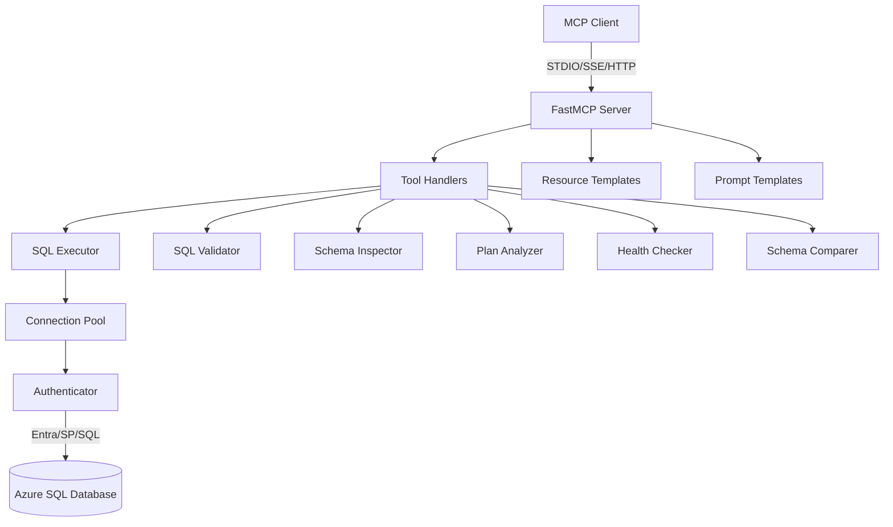

# Phase 8: Testing & DevOps

## Problem

The test suite covers only 5 modules (config, safe_sql, plans, query_store, index_recommendations). Core modules like connection.py, auth.py, server.py, health.py, and capabilities.py have zero test coverage. There is no Docker support, no CI/CD pipeline, and the README contains a hardcoded local path.

---

## 8A. Comprehensive Unit Tests

### Shared Test Infrastructure

**New file:** `tests/conftest.py`

```python
import pytest
from unittest.mock import MagicMock, AsyncMock
from azure_sql_mcp.config import ServerConfig, AuthMode, AccessMode, TransportConfig, TransportMode

@pytest.fixture
def sample_config():
    return ServerConfig(
        server="test-server.database.windows.net",
        default_database="testdb",
        allowed_databases=("testdb", "otherdb"),
        auth_mode=AuthMode.SQL_PASSWORD,
        access_mode=AccessMode.RESTRICTED,
        query_timeout_seconds=30,
        row_limit=200,
        pool_size=5,
        max_retries=3,
        tool_timeout_seconds=45,
        log_format="text",
        username="testuser",
        password="testpass",
        tenant_id=None,
        client_id=None,
        client_secret=None,
        transport=TransportConfig(mode=TransportMode.STDIO, host="127.0.0.1", port=8000),
        log_level="INFO",
    )

@pytest.fixture
def mock_cursor():
    cursor = MagicMock()
    cursor.description = [("col1",), ("col2",)]
    cursor.fetchall.return_value = [("val1", "val2")]
    cursor.nextset.return_value = False
    return cursor

@pytest.fixture
def mock_connection(mock_cursor):
    conn = MagicMock()
    conn.cursor.return_value = mock_cursor
    return conn

@pytest.fixture
def fake_executor():
    """Executor that returns canned responses without hitting a database."""
    executor = AsyncMock()
    executor.fetch_all = AsyncMock(return_value=[])
    executor.execute_batches = AsyncMock(return_value=[])
    executor.execute_non_query = AsyncMock(return_value=0)
    return executor
```

### Test Files to Create

| File | Module Under Test | Key Tests |
|------|------------------|-----------|
| `tests/unit/test_connection.py` | `connection.py` | `fetch_all` returns first result set, `execute_batches` with mock pool, `_coerce_value` for memoryview/bytes, non-query returns row count |
| `tests/unit/test_connection_pool.py` | `connection_pool.py` | Acquire creates new connection, acquire reuses pooled connection, release returns to queue, stale connection evicted, token refresh triggered at 45min, pool-at-capacity blocks, `close_all` drains |
| `tests/unit/test_auth.py` | `auth.py` | `build_connection_arguments` for each auth mode, `obfuscate_secret` patterns, token struct packing format, SQL password mode skips token |
| `tests/unit/test_server.py` | `server.py` | All tools registered, `_run_tool` returns error on exception, `_truncate_rows` limits rows, `_format_error` produces correct shape, tool timeout triggers `asyncio.TimeoutError` |
| `tests/unit/test_health.py` | `health.py` | Each health check category returns expected structure, threshold status evaluation, graceful handling when DMV is unavailable |
| `tests/unit/test_capabilities.py` | `capabilities.py` | Each capability check handles success/failure, returns `{available: true/false}` |
| `tests/unit/test_retry.py` | `retry.py` | Retries on transient error codes, does not retry non-transient errors, respects max_retries=0, exponential backoff timing, jitter applied |
| `tests/unit/test_schema_diff.py` | `schema_diff.py` | Added/removed/modified tables, columns, indexes detected correctly, programmable object definition comparison, empty schemas, identical schemas |
| `tests/unit/test_ddl_generator.py` | `ddl_generator.py` | CREATE TABLE output, ALTER COLUMN output, dependency ordering, bracket escaping, transaction wrapper |
| `tests/unit/test_resources.py` | `resources.py` | Resource templates registered, return expected data shapes |
| `tests/unit/test_prompts.py` | `prompts.py` | Prompts registered, return PromptMessage lists |
| `tests/unit/test_sessions.py` | `sessions.py` | Active sessions query, blocking chain detection |

### Example Test: Connection Pool

```python
# tests/unit/test_connection_pool.py
import asyncio
import pytest
from unittest.mock import patch, MagicMock
from azure_sql_mcp.connection_pool import ConnectionPool

@pytest.mark.asyncio
async def test_acquire_creates_new_connection(sample_config):
    with patch("azure_sql_mcp.connection_pool._import_mssql_python") as mock_driver:
        mock_conn = MagicMock()
        mock_driver.return_value.connect.return_value = mock_conn

        pool = ConnectionPool(sample_config, MagicMock())
        conn = await pool.acquire("testdb")

        assert conn is mock_conn

@pytest.mark.asyncio
async def test_release_and_reuse(sample_config):
    with patch("azure_sql_mcp.connection_pool._import_mssql_python") as mock_driver:
        mock_conn = MagicMock()
        # Validation query succeeds
        mock_cursor = MagicMock()
        mock_cursor.fetchone.return_value = (1,)
        mock_conn.cursor.return_value = mock_cursor
        mock_driver.return_value.connect.return_value = mock_conn

        pool = ConnectionPool(sample_config, MagicMock())
        conn1 = await pool.acquire("testdb")
        await pool.release("testdb", conn1)
        conn2 = await pool.acquire("testdb")

        assert conn2 is conn1  # Reused!
        assert mock_driver.return_value.connect.call_count == 1  # Only created once
```

### Dev Dependencies

Add to `pyproject.toml`:
```toml
[dependency-groups]
dev = [
    "pyright>=1.1.407",
    "pytest>=8.4.0",
    "pytest-asyncio>=1.2.0",
    "ruff>=0.14.0",
]
```

---

## 8B. Integration Tests

### Files
- **Extend:** `tests/integration/test_azure_sql_env.py`
- **New:** `tests/integration/test_introspection.py`
- **New:** `tests/integration/test_tools.py`
- **New:** `tests/integration/test_schema_compare.py`

### Strategy

All integration tests are gated on `AZURE_SQL_SERVER` environment variable:

```python
import pytest
import os

pytestmark = pytest.mark.skipif(
    not os.getenv("AZURE_SQL_SERVER"),
    reason="AZURE_SQL_SERVER not set",
)
```

### Key Integration Tests

1. **test_introspection.py:** Connect to real DB, list schemas, list objects, get details
2. **test_tools.py:** Instantiate full `AzureSqlMcpApplication`, invoke each tool
3. **test_schema_compare.py:** Create two test schemas, compare, validate diff

---

## 8C. Docker Support

### Files
- **New:** `AzureSqlMcp/Dockerfile`
- **New:** `AzureSqlMcp/docker-compose.yml`

### Dockerfile

```dockerfile
FROM python:3.12-slim

# Install runtime libraries required by mssql-python
RUN apt-get update && \
    apt-get install -y --no-install-recommends \
        ca-certificates libltdl7 libkrb5-3 libgssapi-krb5-2 && \
    apt-get clean && rm -rf /var/lib/apt/lists/*

# Install uv
COPY --from=ghcr.io/astral-sh/uv:latest /uv /usr/local/bin/uv

WORKDIR /app
COPY pyproject.toml uv.lock ./
RUN uv sync --frozen --no-dev

COPY src/ src/

EXPOSE 8000

ENTRYPOINT ["uv", "run", "azure-sql-mcp"]
CMD ["--transport", "streamable-http", "--host", "0.0.0.0", "--port", "8000"]
```

### docker-compose.yml (for local dev/testing)

```yaml
version: "3.8"
services:
  azure-sql-mcp:
    build: .
    ports:
      - "8000:8000"
    environment:
      - AZURE_SQL_SERVER=${AZURE_SQL_SERVER}
      - AZURE_SQL_DEFAULT_DATABASE=${AZURE_SQL_DEFAULT_DATABASE}
      - AZURE_SQL_ALLOWED_DATABASES=${AZURE_SQL_ALLOWED_DATABASES}
      - AZURE_SQL_AUTH_MODE=${AZURE_SQL_AUTH_MODE:-sql-password}
      - AZURE_SQL_USERNAME=${AZURE_SQL_USERNAME}
      - AZURE_SQL_PASSWORD=${AZURE_SQL_PASSWORD}
    depends_on:
      - sqlserver

  sqlserver:
    image: mcr.microsoft.com/mssql/server:2022-latest
    environment:
      - ACCEPT_EULA=Y
      - MSSQL_SA_PASSWORD=YourStrong!Passw0rd
      - MSSQL_PID=Developer
    ports:
      - "1433:1433"
    volumes:
      - sqlserver_data:/var/opt/mssql

volumes:
  sqlserver_data:
```

---

## 8D. CI/CD Pipeline

### Files
- **New:** `.github/workflows/ci.yml`
- **New:** `.github/workflows/integration.yml`

### ci.yml (runs on every push/PR)

```yaml
name: CI
on: [push, pull_request]

jobs:
  test:
    runs-on: ubuntu-latest
    strategy:
      matrix:
        python-version: ["3.12", "3.13"]
    steps:
      - uses: actions/checkout@v4
      - uses: astral-sh/setup-uv@v4
      - run: uv sync
      - run: uv run ruff check src tests
      - run: uv run pyright
      - run: uv run python -m compileall -q src tests
      - run: uv run pytest -q
      - run: uv build
```

### integration.yml (manual dispatch or on main merge)

```yaml
name: Integration Tests
on:
  workflow_dispatch:
  push:
    branches: [main]

jobs:
  integration:
    runs-on: ubuntu-latest
    services:
      sqlserver:
        image: mcr.microsoft.com/mssql/server:2022-latest
        env:
          ACCEPT_EULA: "Y"
          MSSQL_SA_PASSWORD: "YourStrong!Passw0rd"
        ports:
          - 1433:1433
    steps:
      - uses: actions/checkout@v4
      - uses: astral-sh/setup-uv@v4
      - run: |
          # Install runtime libraries required by mssql-python
          sudo apt-get update && sudo apt-get install -y libltdl7 libkrb5-3 libgssapi-krb5-2
      - run: cd AzureSqlMcp && uv sync --dev
      - run: cd AzureSqlMcp && uv run pytest tests/integration/ -v
        env:
          AZURE_SQL_SERVER: "localhost"
          AZURE_SQL_DEFAULT_DATABASE: "master"
          AZURE_SQL_ALLOWED_DATABASES: "master,testdb"
          AZURE_SQL_AUTH_MODE: "sql-password"
          AZURE_SQL_USERNAME: "sa"
          AZURE_SQL_PASSWORD: "YourStrong!Passw0rd"
```

### Dev Dependencies for CI

Add to `pyproject.toml`:
```toml
[dependency-groups]
dev = [
    "pyright>=1.1.407",
    "pytest>=8.4.0",
    "pytest-asyncio>=1.2.0",
    "ruff>=0.14.0",
]
```

---

## 8E. README Improvements

### Changes

1. **Remove hardcoded local path** (line 27): Change to relative `cd AzureSqlMcp`
2. **Add MCP client configuration examples:**

```markdown
### Claude Desktop

Add to `~/Library/Application Support/Claude/claude_desktop_config.json`:

```json
{
  "mcpServers": {
    "azure-sql": {
      "command": "uv",
      "args": ["--directory", "/path/to/AzureSqlMcp", "run", "azure-sql-mcp"],
      "env": {
        "AZURE_SQL_SERVER": "your-server.database.windows.net",
        "AZURE_SQL_DEFAULT_DATABASE": "appdb",
        "AZURE_SQL_ALLOWED_DATABASES": "appdb"
      }
    }
  }
}
```

### VS Code MCP Extension

Add to `.vscode/settings.json`:

```json
{
  "mcp.servers": {
    "azure-sql": {
      "command": "uv",
      "args": ["--directory", "/path/to/AzureSqlMcp", "run", "azure-sql-mcp"],
      "env": { ... }
    }
  }
}
```
```

3. **Add architecture diagram** (Mermaid):



4. **Document all new tools** with examples
5. **Document security model** (from Phase 7)

---

## Verification

1. `uv run ruff check src tests` -- no lint errors
2. `uv run pyright` -- source type check passes
3. `uv run python -m compileall -q src tests` -- source and tests compile
4. `uv run pytest -q` -- all tests pass
5. `uv build` -- package builds successfully
6. `docker build -t azure-sql-mcp .` -- image builds successfully
